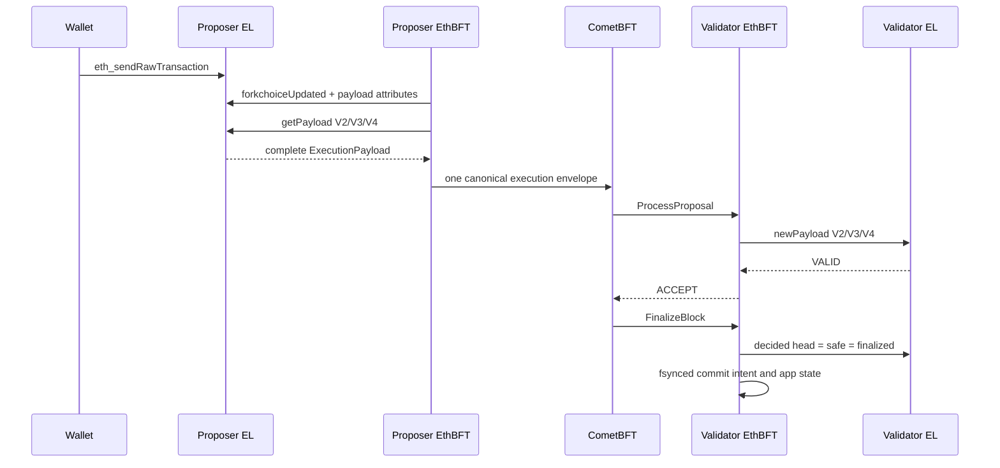

# Architecture

## Consensus data

A CometBFT block contains exactly one protocol-v2 envelope. Canonical RLP binds
the chain ID, consensus height, previous app hash, Engine API version, full
execution payload, Cancun blob hashes/beacon root, and Prague execution
requests. Validators reconstruct and hash the Ethereum block before asking the
EL to validate it.

## Compatibility boundary

EthBFT uses one JWT-authenticated endpoint and standardized
`engine_exchangeCapabilities`, `forkchoiceUpdated`, `getPayload`, and
`newPayload` methods. Fork activation timestamps are consensus parameters and
are included in the protocol fingerprint persisted by every validator.

## Recovery boundary

Before advancing EL forkchoice, EthBFT stores a commit intent atomically and
fsyncs it. Startup replays an incomplete intent. Persisted chain ID, genesis,
protocol version, and protocol fingerprint mismatches stop startup rather than
guessing.

ABCI snapshot state sync is not implemented. That missing replacement path is
one reason the alpha is not yet production-ready.
