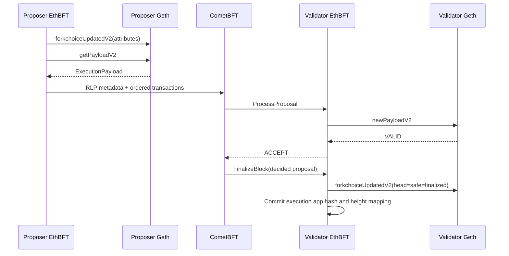

# Architecture

EthBFT delegates networking and Byzantine agreement to CometBFT and delegates
Ethereum state transition execution to Geth. Its own responsibility is the
small consensus-critical adapter between ABCI and the Engine API.



## Proposal encoding

The first CometBFT proposal item starts with the reserved eight-byte prefix
`ETHBFT\x00\x01` and contains canonical RLP execution metadata. Every remaining
item is one raw Ethereum transaction. Their byte representation, membership,
and order exactly reconstruct `ExecutionPayload.transactions`.

Protocol v1 metadata binds:

- protocol and Engine API versions;
- chain ID and CometBFT height;
- previous ABCI app hash;
- parent and proposed EL block hashes;
- state and receipts roots;
- timestamp, randomness, fee recipient, gas, bloom, and base fee; and
- an explicit empty withdrawal list.

Geth's `ExecutableDataToBlock` recomputes the Ethereum header and block hash
before the payload is sent to the local Engine API.

## ABCI lifecycle

### PrepareProposal

The proposer injects valid candidates into its dedicated Geth txpool, derives
payload attributes from CometBFT height/time and committed app state, then asks
Geth to build a payload. The resulting payload order becomes consensus data.

### ProcessProposal

Every validator performs deterministic checks and calls `engine_newPayloadV2`.
Only `VALID` is accepted. `SYNCING`, `ACCEPTED`, timeouts, malformed envelopes,
wrong parents, wrong timestamps, and incorrect block hashes reject the proposal.

### FinalizeBlock and Commit

`FinalizeBlock` revalidates the decided payload and advances EL forkchoice.
`Commit` atomically persists the ABCI app hash and height mapping. Until Commit
succeeds, `Info` continues to report the previous height.

## Execution commitment

The app hash is domain-separated and commits to:

```text
previous app hash
chain ID
CometBFT height
EL parent hash
EL block hash
state root
receipts root
transaction root
```

Startup verifies that the persisted block remains canonical and restores the
committed block as EL head, safe, and finalized.

## Code layout

```text
pkg/protocol/proposal.go  canonical execution envelope
pkg/bridge/server.go      ABCI lifecycle
pkg/bridge/engine.go      proposal building and EL validation
pkg/bridge/state.go       commit persistence and reconciliation
pkg/ethereum/client.go    authenticated Engine API transport
```
