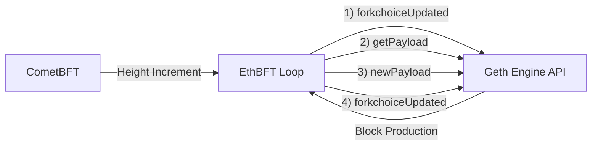

# Introduction

EthBFT is an experimental, single-sequencer bridge that uses CometBFT to order Ethereum transactions and drives Geth through the Engine API.

> **Status:** Proof-of-concept / demo. CometBFT success means accepted for asynchronous delivery. It does not mean executed, and this design does not provide multi-validator consensus over EL state.

## 🚀 Features (Current Scope)

- **Engine API Loop**: Implements the minimal sequence: forkchoiceUpdated → getPayload → newPayload → forkchoiceUpdated (final) per CometBFT height.
- **Height Tracking**: Maintains mapping of CometBFT height → EL head hash to choose parents. Persisted to disk (`ethbft_state.json`).
- **ABCI Integration**: Implements ABCI methods with transaction validation (RLP decoding & ChainID check) and injection into Geth.
- **Dynamic Parent Selection**: Falls back to EL latest head or genesis if internal map has no parent yet.
- **Finality Lag**: Configurable `finalityDepth` to delay safe/finalized head updates relative to current head.
- **JWT (HS256) Auth**: Automatically signs Engine API calls when a JWT secret is provided.
- **Health & Metrics**: HTTP `/health` (port 8081), Prometheus metrics, plus ABCI socket (8080).
- **Docker Stack**: One‑command demo bringing up Geth + EthBFT + CometBFT.
- **Configurable**: Supports `feeRecipient` and bridging toggle.

## Architecture & Flow

High‑level data/control flow (current minimal mode):

```mermaid
graph LR
    A[CometBFT] -- Height Increment --> B[EthBFT Loop]
    B -- 1) forkchoiceUpdated --> C[Geth Engine API]
    B -- 2) getPayload --> C
    B -- 3) newPayload --> C
    B -- 4) forkchoiceUpdated --> C
    C -- Block Production --> B
```

1. Poll CometBFT `status` every 2s; detect new `latest_block_height`.
2. For each new height H: pick parent hash (cached prior EL head or fallback) and run Engine API sequence.
3. Verify exact transaction-hash inclusion before advancing the EL head.
4. Persist delivery results, ABCI state, and the H → headHash mapping.
