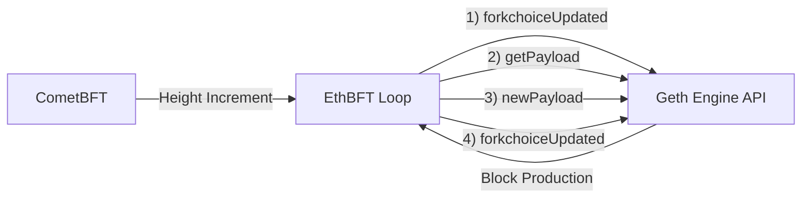

# Introduction

EthBFT is an experimental, lightweight bridge that drives an Ethereum Execution Layer (EL) client (e.g. Geth) using CometBFT block heights as a timing/advancement signal. It focuses on the **Engine API orchestration loop** (forkchoice + payload production) rather than full state / transaction integration. For every new CometBFT height, EthBFT requests the EL to build (currently empty) blocks and advances forkchoice accordingly.

> **Status:** Proof‑of‑concept / demo. ABCI logic includes basic transaction validation. Blocks produced by Geth include transactions injected from CometBFT. Expect breaking changes.

## 🚀 Features (Current Scope)

- **Engine API Loop**: Implements the minimal sequence: forkchoiceUpdated → getPayload → newPayload → forkchoiceUpdated (final) per CometBFT height.
- **Height Tracking**: Maintains mapping of CometBFT height → EL head hash to choose parents. Persisted to disk (`ethbft_state.json`).
- **ABCI Integration**: Implements ABCI methods with transaction validation (RLP decoding & ChainID check) and injection into Geth.
- **Dynamic Parent Selection**: Falls back to EL latest head or genesis if internal map has no parent yet.
- **Finality Lag**: Configurable `finalityDepth` to delay safe/finalized head updates relative to current head.
- **JWT (HS256) Auth**: Automatically signs Engine API calls when a JWT secret is provided.
- **Health & Metrics**: HTTP `/health` (port 8081), Prometheus metrics, plus ABCI socket (8080).
- **Docker Stack**: One‑command demo bringing up Geth + EthBFT + CometBFT.
- **Configurable**: Supports `feeRecipient` and bridging toggle.

## Architecture & Flow

High‑level data/control flow (current minimal mode):

1. Poll CometBFT `status` every 2s; detect new `latest_block_height`.
2. For each new height H: pick parent hash (cached prior EL head or fallback) and run Engine API sequence.
3. Set head/safe/finalized all to the newly produced block hash (demo simplification).
4. Cache (H → headHash) for next iteration.
