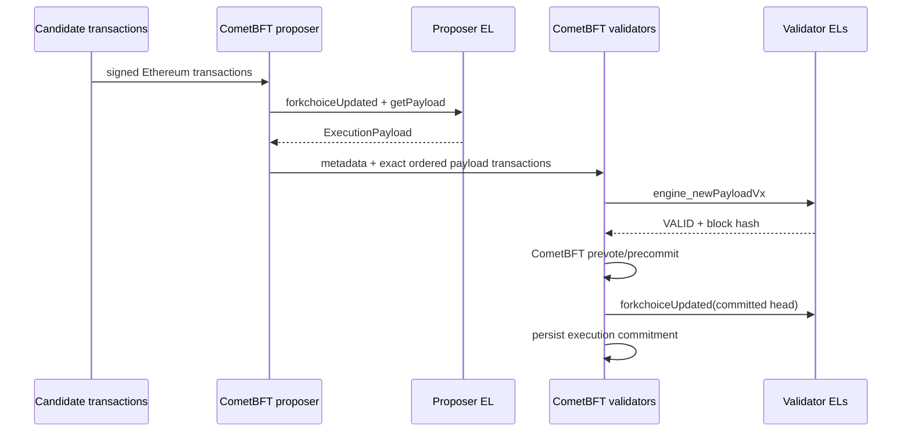

# RFC 0001: BFT Consensus over Ethereum Execution Payloads

- **Status:** Draft
- **Category:** Consensus
- **Created:** 2026-07-19
- **Target release:** EthBFT v0.1.0
- **Supersedes:** The asynchronous transaction-delivery protocol used through v0.0.10

> **MVP implementation:** v0.1.0 implements the Engine API V2 proposal,
> validation, execution commitment, and crash-recovery core of this RFC. The RFC
> remains Draft until multi-validator E2E, genesis-backed protocol parameters,
> transactional storage, and paired ABCI/EL state sync are complete.

## Abstract

This RFC defines the first protocol in which EthBFT provides Byzantine fault
tolerant consensus over Ethereum execution results.

CometBFT validators do not merely agree on a list of Ethereum transactions.
They agree on a complete, versioned Ethereum execution payload. Every validator
validates the proposed payload against an independent Ethereum Execution Layer
(EL) client before accepting the CometBFT proposal. After CometBFT commits the
proposal, every validator advances its local EL forkchoice to the committed
payload and persists a commitment to the resulting Ethereum block and state.

The resulting safety property is:

> If fewer than one third of the CometBFT voting power is Byzantine, two honest
> EthBFT validators cannot commit different Ethereum execution blocks at the
> same EthBFT height.

This protocol replaces the current asynchronous model in which CometBFT first
commits transaction bytes and a single bridge process later attempts to deliver
them to Geth.

## Status of This Document

This is a draft protocol specification. The keywords **MUST**, **MUST NOT**,
**REQUIRED**, **SHOULD**, **SHOULD NOT**, and **MAY** are to be interpreted as
normative requirements.

The protocol is not backward-compatible with the v0.0.10 application state or
chain history. Implementations of this RFC MUST start a new CometBFT chain and
use a new EthBFT protocol version.

## Motivation

The v0.0.10 design has three fundamental limitations:

1. CometBFT commits transactions before Ethereum execution succeeds.
2. A single bridge process decides which Geth payload becomes canonical.
3. The ABCI application hash does not commit to the Ethereum block hash, state
   root, receipts root, or transaction root.

Consequently, CometBFT consensus currently provides transaction ordering but
does not provide consensus over Ethereum state. That design is useful as a
delivery demo but is not an EthBFT consensus protocol.

This RFC makes the Ethereum execution payload itself part of the CometBFT
proposal and requires every validator to validate the same state transition.

## Goals

The protocol MUST provide:

- BFT agreement on one Ethereum block hash per CometBFT height.
- Independent execution validation by every validator's EL client.
- Exact agreement on transaction membership and order.
- A deterministic ABCI application hash that commits to Ethereum execution.
- Crash-safe, idempotent replay of decided CometBFT blocks.
- Deterministic Engine API version selection across Ethereum forks.
- Rejection of proposals that cannot be fully validated locally.
- A path for new validators to obtain a matching CometBFT and EL checkpoint.

## Non-goals

This RFC does not define:

- A trustless bridge between EthBFT and Ethereum mainnet.
- An Ethereum consensus-layer implementation or beacon-chain compatibility.
- MEV policy, proposer-builder separation, or encrypted mempools.
- Validator selection or staking rules beyond those supplied by CometBFT.
- Fraud proofs or validity proofs for clients that do not run an EL.
- Cross-chain asset custody or message-passing contracts.

These features may be specified by later RFCs.

## Terminology

- **Consensus height:** A CometBFT block height.
- **Execution block:** The Ethereum block committed at one consensus height.
- **Execution parent:** The execution block committed at the previous consensus
  height.
- **Candidate transaction:** A signed Ethereum transaction available to the
  proposer when building a payload.
- **Execution metadata:** Consensus data needed to reconstruct and validate an
  Engine API request, excluding the transaction byte arrays stored separately
  in the CometBFT proposal.
- **Execution commitment:** A deterministic commitment to the committed
  execution block and its state transition.
- **Local EL:** The dedicated Ethereum execution client operated by one EthBFT
  validator.
- **Protocol parameters:** Consensus-critical EthBFT configuration included in
  genesis or updated through a future governance mechanism.

## System Model

Each CometBFT validator MUST operate:

1. one EthBFT ABCI application instance; and
2. one independent, dedicated Ethereum EL instance exposing the authenticated
   Engine API.

An EL instance MUST NOT be shared by validators that are intended to fail
independently. Public JSON-RPC access MUST NOT be allowed to mutate the EL
chain, txpool, or forkchoice outside the EthBFT process.

All validators MUST use the same:

- Ethereum genesis block and chain ID;
- Ethereum fork schedule;
- EthBFT protocol parameters;
- Engine API method selection rules; and
- execution block gas limit policy.

A validator that cannot validate a proposal because its EL is offline,
syncing, on the wrong chain, or running an incompatible fork MUST reject the
proposal and report itself not ready. It MUST NOT vote based only on the
proposer's claimed roots.

## Protocol Overview

For consensus height `H`:

1. The proposer builds an Ethereum execution payload whose parent is the
   execution block committed at height `H - 1`.
2. The proposer places one `ExecutionMetadata` item followed by the exact raw
   Ethereum transactions from the payload into the CometBFT proposal.
3. Each validator reconstructs the complete Engine API payload from the
   metadata and ordered transactions.
4. Each validator checks all consensus rules and calls `engine_newPayloadVx`
   against its local EL.
5. A validator accepts the proposal only when the EL returns `VALID` and the
   validated block hash equals the proposed block hash.
6. CometBFT reaches consensus on the proposal.
7. During finalization, each validator advances local EL forkchoice to the
   committed block and persists the new execution commitment.



## Consensus Proposal Format

### Proposal transaction layout

At height `H`, `RequestPrepareProposal.Txs` MUST be transformed into:

```text
Txs[0]   = ETHBFT_ENVELOPE_PREFIX || encoded ExecutionMetadata
Txs[1]   = first raw Ethereum transaction in ExecutionPayload.transactions
Txs[2]   = second raw Ethereum transaction in ExecutionPayload.transactions
...
Txs[N]   = final raw Ethereum transaction in ExecutionPayload.transactions
```

`ETHBFT_ENVELOPE_PREFIX` is the eight-byte ASCII value `ETHBFT\x00\x01`.
Ordinary Ethereum transactions cannot use this prefix as a valid typed or
legacy transaction encoding.

There MUST be exactly one envelope and it MUST be the first proposal item.
Every remaining proposal item MUST be a valid raw Ethereum transaction.

The transaction list reconstructed from `Txs[1:N]` MUST exactly equal
`ExecutionPayload.transactions`, including byte representation, membership,
and order. The metadata MUST NOT contain a second copy of transaction bytes.

The entire proposal MUST fit within CometBFT's `MaxTxBytes`. A proposer MUST
NOT truncate an already-built payload. It must request or construct another
payload that fits, or propose an empty execution block.

### Encoding

`ExecutionMetadata` MUST use the versioned canonical RLP codec defined in the
implementation package `pkg/protocol`. It is encoded as one RLP list whose field
order is the order in `ExecutionMetadata` below. Integers use RLP's minimal
unsigned big-endian representation; fixed hashes and addresses use their raw
byte representation. Unknown versions, non-minimal integer encodings, trailing
bytes, unknown fields, and list-length mismatches MUST be rejected. JSON MUST
NOT be used as the consensus encoding.

Consensus hashes are computed from explicitly defined fields and MUST NOT rely
on map iteration order or implementation-specific object serialization.

### ExecutionMetadata

The following field order is normative. Protocol v1 omits the final four
post-Cancun fields from its RLP list and rejects payloads that require them.

```text
ExecutionMetadata {
    protocol_version:          uint32
    engine_api_version:        uint8
    chain_id:                  uint256
    consensus_height:          uint64
    previous_app_hash:         bytes32

    parent_hash:               bytes32
    fee_recipient:             bytes20
    state_root:                bytes32
    receipts_root:             bytes32
    logs_bloom:                bytes256
    prev_randao:               bytes32
    block_number:              uint64
    gas_limit:                 uint64
    gas_used:                  uint64
    timestamp:                 uint64
    extra_data:                bytes
    base_fee_per_gas:          uint256
    block_hash:                bytes32

    withdrawals:               list<Withdrawal>
    blob_gas_used:             optional<uint64>
    excess_blob_gas:           optional<uint64>
    versioned_hashes:          list<bytes32>
    parent_beacon_block_root:  optional<bytes32>
    execution_requests:        list<bytes>
}
```

The execution payload's transactions are taken from the proposal items after
the envelope. `transactions_root` is recomputed from those transactions and is
not trusted from metadata.

The metadata fields present for a given height MUST exactly match the Engine
API version selected by the protocol fork schedule.

## Consensus-Critical Parameters

The following values MUST be stored in EthBFT genesis state and included in
the genesis application hash:

- `protocol_version`
- Ethereum `chain_id`
- Ethereum genesis block hash
- Ethereum fork activation schedule
- maximum execution gas limit
- maximum transaction bytes per proposal
- fee recipient policy
- withdrawal policy
- deterministic `prev_randao` derivation rule
- deterministic parent beacon block root derivation rule
- maximum `extra_data` length
- supported Engine API versions

Local YAML configuration MAY specify endpoints, JWT paths, logging, and
timeouts. It MUST NOT override consensus-critical parameters.

The application MUST fail startup when local EL chain ID, genesis hash, or fork
schedule does not match genesis state.

## Deterministic Header Inputs

### Parent hash

For height `H > initial_height`, `parent_hash` MUST equal the execution block
hash committed at `H - 1`.

At `initial_height`, `parent_hash` MUST equal the execution genesis block hash
defined in EthBFT genesis state.

### Timestamp

The execution payload timestamp MUST equal the Unix timestamp from the
CometBFT proposed block header.

It MUST be strictly greater than the execution parent's timestamp. Validators
MUST reject a proposal that violates either condition. EthBFT MUST NOT replace
the consensus timestamp with a validator's local wall clock.

### prevRandao

For protocol version 1:

```text
prev_randao = keccak256(
    "ETHBFT_PREVRANDAO_V1" ||
    uint256_be(chain_id) ||
    uint64_be(consensus_height) ||
    previous_app_hash
)
```

This value is deterministic and is not intended to provide unbiasable
randomness. Applications requiring secure randomness MUST use a separately
specified randomness protocol.

### Fee recipient

The fee recipient MUST be derived from the consensus fee recipient policy. The
initial policy is a single address fixed in genesis. A local validator setting
MUST NOT change it.

### Withdrawals and beacon root

Protocol version 1 uses an empty withdrawals list unless genesis defines a
deterministic withdrawal source.

When the active Engine API version requires `parent_beacon_block_root`, it is:

```text
parent_beacon_block_root = keccak256(
    "ETHBFT_BEACON_ROOT_V1" ||
    uint64_be(consensus_height) ||
    previous_app_hash
)
```

This field exists to satisfy Ethereum execution semantics; EthBFT does not
claim that it represents an Ethereum beacon block.

## Engine API Version Selection

Engine API version selection MUST be a pure function of the consensus
timestamp and the fork schedule in genesis:

| Active execution fork | forkchoiceUpdated | getPayload | newPayload |
| --- | --- | --- | --- |
| Shanghai | V2 | V2 | V2 |
| Cancun | V3 | V3 | V3 |
| Prague or later with execution requests | V3 | V4 | V4 |

The exact method matrix MUST track the execution specification adopted by the
chain. Changing it requires a protocol upgrade activated at a consensus height
or timestamp.

Validators MUST reject envelopes whose declared method version differs from
the deterministic version for that height.

## ABCI Method Semantics

### Info

`Info` MUST return the last fully committed consensus height and its execution
commitment as `LastBlockAppHash`.

It MUST NOT report a height that exists only in a prepared write-ahead record.

### CheckTx

`CheckTx` performs admission checks only. It MUST validate:

- maximum transaction size;
- Ethereum transaction decoding;
- chain ID;
- signature;
- transaction type allowed by the active fork; and
- reserved envelope-prefix exclusion.

`CheckTx` success does not promise inclusion or execution. This is normal
mempool admission semantics, not the asynchronous delivery status used by the
old protocol.

### PrepareProposal

Only the current proposer builds a payload.

The proposer MUST:

1. read the committed execution parent from durable state;
2. derive deterministic payload attributes from the request and protocol
   parameters;
3. make candidate Ethereum transactions available to its dedicated builder;
4. call the version-selected `engine_forkchoiceUpdatedVx` with payload
   attributes;
5. call `engine_getPayloadVx`;
6. reject the local build result unless its parent and deterministic attributes
   match the required values;
7. construct `ExecutionMetadata` from the payload;
8. return the envelope followed by exactly the payload transactions in payload
   order; and
9. ensure the proposal fits the CometBFT byte limit.

The proposer MAY select, omit, and reorder candidate mempool transactions as
allowed by Ethereum validity rules. The resulting payload transaction order,
not the arrival order in the CometBFT mempool, is the consensus order.

An implementation MAY use a dedicated Geth payload builder initially. A future
builder interface may provide explicit candidate allowlists. Regardless of the
builder implementation, validators trust only the payload they independently
validate.

`PrepareProposal` MUST NOT advance canonical EL forkchoice to the candidate
payload.

### ProcessProposal

Every validator MUST perform all of the following checks before returning
`ACCEPT`:

1. Decode exactly one envelope at proposal index zero.
2. Reject unknown protocol or Engine API versions.
3. Verify chain ID, consensus height, and previous app hash.
4. Verify parent hash equals the locally committed execution head.
5. Verify all deterministic header inputs and consensus parameters.
6. Decode every remaining item as an Ethereum transaction.
7. Reject duplicate transaction hashes within the payload.
8. Reconstruct the complete versioned Engine API payload.
9. Recompute and compare the transaction root and execution block hash.
10. Call the version-selected `engine_newPayloadVx` on the local EL.
11. Require payload status `VALID`.
12. Require `latestValidHash` to equal the proposed block hash when the EL
    returns a non-null latest valid hash.

`ACCEPTED`, `SYNCING`, a timeout, an unavailable EL, a null response, or any
other status MUST cause `REJECT`.

`ProcessProposal` may insert a validated non-canonical block into the local EL
database. It MUST NOT update canonical forkchoice.

Validation results MAY be cached by `(consensus_height, block_hash)`. Cache
entries are non-authoritative and MUST be safe to discard.

### FinalizeBlock

`FinalizeBlock` is called for the block decided by CometBFT. The application
MUST:

1. repeat all deterministic checks;
2. require a successful local EL validation, re-running `engine_newPayloadVx`
   if no valid cache entry exists;
3. compute the new execution commitment;
4. durably write a prepared commit record;
5. call `engine_forkchoiceUpdatedVx` with the decided execution block; and
6. stage the new application height and hash for `Commit`.

All Ethereum transaction results returned by `FinalizeBlock` represent
transactions included in a valid, decided execution payload. There is no later
asynchronous delivery phase.

### Commit

`Commit` MUST atomically mark the prepared record committed and fsync the
application state before returning success.

After `Commit`, `Info` MUST report the new height and app hash.

### Query

The application SHOULD expose deterministic queries for:

- consensus height to execution block hash;
- execution block hash to consensus height;
- transaction hash to committed execution block;
- current execution commitment; and
- protocol parameters and active fork version.

Query results intended for remote verification SHOULD include CometBFT query
proofs where supported.

### Snapshot methods

Production deployments MUST implement ABCI state snapshots. A snapshot MUST
identify a matching EL checkpoint by block hash and state root. Restoring only
the ABCI database without restoring or synchronizing the matching EL state is
invalid.

The first development milestone MAY require validators to replay from genesis,
but the network MUST NOT be described as production-ready until checkpointed
state sync is implemented and tested.

## Execution Commitment and App Hash

For protocol version 1, define:

```text
execution_commitment = keccak256(
    "ETHBFT_EXECUTION_COMMITMENT_V1" ||
    uint256_be(chain_id) ||
    uint64_be(consensus_height) ||
    parent_hash ||
    block_hash ||
    state_root ||
    receipts_root ||
    transactions_root
)
```

The ABCI app hash is:

```text
app_hash = sha256(
    "ETHBFT_APP_HASH_V1" ||
    previous_app_hash ||
    execution_commitment ||
    protocol_parameters_hash
)
```

All fixed-width integers use unsigned big-endian encoding. Hash fields are raw
32-byte values without textual `0x` prefixes.

`protocol_parameters_hash` is a deterministic commitment to the active
consensus-critical parameters. Its precise canonical container MUST be defined
before this RFC reaches Accepted status.

The app hash commits to Ethereum execution state; it is not itself an Ethereum
state root.

## EL Forkchoice and Finality

Once a CometBFT block is decided, its execution payload is BFT-final under the
CometBFT fault assumption. Protocol version 1 therefore sets:

```text
headBlockHash      = committed block hash
safeBlockHash      = committed block hash
finalizedBlockHash = committed block hash
```

Validators MUST NOT configure local safe or finalized depth values. Any future
delayed-finality policy must be consensus-critical and introduced through a
protocol upgrade.

The local EL MUST NOT be allowed to select another canonical head. EthBFT is
the only forkchoice authority for its dedicated EL.

## Durable State

The JSON state file used through v0.0.10 is insufficient for this protocol.
Implementations MUST use a transactional state store with:

- atomic batches;
- write-ahead recovery;
- fsync before acknowledging `Commit`;
- corruption detection;
- schema versioning;
- exclusive process locking; and
- checkpoint or backup support.

The minimum committed record contains:

```text
CommittedExecutionState {
    schema_version
    protocol_version
    chain_id
    ethereum_genesis_hash
    consensus_height
    execution_block_number
    execution_block_hash
    execution_parent_hash
    state_root
    receipts_root
    transactions_root
    app_hash
    protocol_parameters_hash
}
```

The store MUST retain enough recent height mappings to serve proofs and detect
replay conflicts. Historical pruning rules require a separate specification.

## Crash Recovery and Replay

All ABCI handlers MUST be deterministic and idempotent for the same decided
block.

On startup, EthBFT MUST:

1. acquire exclusive ownership of its state store;
2. load the last committed application record;
3. verify local EL chain ID and genesis hash;
4. query the committed execution block by hash;
5. verify its number, parent, state root, and canonical status;
6. inspect any prepared but uncommitted record; and
7. reconcile local EL forkchoice with the last committed record.

Recovery rules:

- If the committed execution block is present but non-canonical, EthBFT MUST
  restore forkchoice to it before becoming ready.
- If a prepared block is present in the EL but application `Commit` was not
  completed, EthBFT MUST report only the prior committed height and allow
  CometBFT to replay the decided block.
- Replaying the same `(height, block_hash)` MUST succeed idempotently.
- Observing a different block hash for an already committed height is a fatal
  safety violation. The node MUST halt.
- If the committed block or required EL state is unavailable, the validator
  MUST remain unready and MUST NOT participate in consensus until state is
  restored.

## Validator Readiness

A validator is ready to vote only when:

- the ABCI state store is healthy;
- the local EL is reachable and not syncing;
- chain ID, genesis hash, and fork schedule match;
- local EL canonical head equals the committed execution head;
- no unresolved state-store reconciliation exists; and
- the node supports the Engine API version active at the next height.

Liveness and readiness endpoints MUST be separate. Liveness indicates that the
process can serve requests. Readiness indicates that it is safe to participate
in consensus.

CometBFT validator operation SHOULD be automatically disabled or externally
alerted when EthBFT readiness fails.

## Byzantine and Failure Cases

Validators MUST reject at least the following proposal faults:

- wrong execution parent;
- wrong consensus height or previous app hash;
- invalid or unsupported envelope encoding;
- envelope not at proposal index zero;
- wrong Engine API version;
- local-clock-derived timestamp;
- wrong `prev_randao`, fee recipient, withdrawals, or beacon root;
- malformed, unsigned, wrong-chain, or duplicate transactions;
- mismatch between proposal transaction order and execution payload;
- invalid block hash, transaction root, state root, or receipts root;
- invalid blob versioned hashes or execution requests;
- EL response other than `VALID`;
- payload exceeding CometBFT or Ethereum limits; and
- proposal for a height that conflicts with committed state.

A Byzantine proposer can choose transaction membership and ordering, subject to
Ethereum validity and CometBFT limits. This affects fairness and censorship but
does not violate execution safety. Fair-ordering mechanisms are outside this
RFC.

## Data Availability

The full execution metadata and transaction bytes are included in the
CometBFT block. A validator therefore has all block-body data needed for
execution validation.

For blob transactions, the Engine API payload contains versioned hashes but not
necessarily all blob sidecar data. Before Cancun support is enabled, a follow-up
specification MUST define blob sidecar propagation, availability validation,
retention, and recovery. Until then, EthBFT genesis MUST keep blob transactions
disabled.

## Networking and Security

- Engine API endpoints MUST remain private and JWT-authenticated.
- Public JSON-RPC transaction submission to validator ELs SHOULD be disabled.
- Ethereum transactions SHOULD enter through the CometBFT RPC or a controlled
  EthBFT admission endpoint.
- Consensus and P2P ports MUST follow standard CometBFT security guidance.
- Query, health, readiness, and metrics endpoints MUST have explicit exposure
  policies.
- Protocol logs MUST include consensus height, execution block hash, parent
  hash, Engine API version, validation result, and commit phase.
- Secrets MUST never be logged.

## Observability Requirements

Implementations MUST expose at least:

- committed consensus height;
- committed EL block number and hash;
- proposal build duration;
- proposal validation duration;
- Engine API status counts by method and response status;
- proposal rejection counts by stable reason code;
- EL/ABCI head mismatch;
- state-store commit and fsync failures;
- replay and reconciliation counts; and
- validator readiness state.

Alerts SHOULD cover stalled consensus, EL divergence, repeated proposal
rejection, unsupported upcoming fork, state corruption, and readiness failure.

## Compatibility and Migration

There is no safe in-place migration from the v0.0.10 chain because historical
CometBFT app hashes did not commit to Ethereum execution results.

Migration MUST use:

1. a new CometBFT genesis document;
2. a new protocol version;
3. an explicitly selected Ethereum genesis or checkpoint;
4. a genesis execution commitment agreed out of band; and
5. clean validator state stores and dedicated EL datadirs.

Old asynchronous delivery endpoints and persisted delivery statuses SHOULD be
removed rather than carried into the consensus state.

## Required Test Matrix

Before this RFC can move to Accepted, automated tests MUST demonstrate:

### Determinism

- Four validators independently accept the same payload and app hash.
- Transaction membership and ordering are identical on all ELs.
- All validators derive identical timestamps, randomness, roots, and Engine API
  versions.

### Byzantine proposals

- Wrong parent, block hash, state root, transaction root, and receipts root.
- Reordered, removed, inserted, duplicated, and malformed transactions.
- Wrong fork version and fork-specific fields.
- Oversized and non-canonical envelope encodings.

### EL failures

- EL unavailable during `PrepareProposal`.
- EL unavailable, `SYNCING`, `ACCEPTED`, and timeout during
  `ProcessProposal`.
- One validator running an incompatible EL or fork schedule.
- Local EL head changed outside EthBFT.

### Crash recovery

- Crash before `engine_newPayload`.
- Crash after validation but before CometBFT decision.
- Crash after the prepared state write.
- Crash after forkchoice update but before application `Commit`.
- Crash after durable `Commit` but before the ABCI response.
- Replay of the same decided block at every crash point.

### Network behavior

- One Byzantine validator among four.
- Proposer failure and proposer rotation.
- Validator partition and recovery.
- New validator synchronization from genesis and from checkpoint.

The test suite MUST compare committed block hash, state root, receipts root,
transaction root, app hash, and canonical EL head across all honest validators.

## Implementation Plan

### Milestone 1: Protocol types

- Add `pkg/protocol` with versioned metadata and deterministic hashing.
- Move consensus parameters into a genesis-backed structure.
- Add golden encoding and hash vectors.

### Milestone 2: Proposal validation

- Implement the new proposal layout.
- Implement static proposal validation and Engine API version selection.
- Implement strict `engine_newPayload` validation in `ProcessProposal`.

### Milestone 3: Proposal building

- Move payload production into `PrepareProposal`.
- Introduce a dedicated builder interface.
- Ensure payload transactions become the exact ordered CometBFT proposal
  transactions.

### Milestone 4: Commit and recovery

- Replace the JSON state file with a transactional store.
- Implement prepared and committed records.
- Move canonical forkchoice advancement to decided-block finalization.
- Implement idempotent replay and startup reconciliation.

### Milestone 5: Multi-validator E2E

- Run at least four CometBFT validators and four independent EL clients.
- Add Byzantine proposal, crash-window, and divergence tests.
- Add required readiness and consensus metrics.

### Milestone 6: State sync and proofs

- Implement paired ABCI/EL checkpoints.
- Implement snapshot restoration validation.
- Add query proofs and light-client-facing execution commitments.

## Acceptance Criteria

This RFC may move from Draft to Accepted only when:

1. canonical RLP metadata and protocol-parameter hash vectors are merged;
2. consensus-critical genesis parameters are fully specified;
3. four-validator E2E tests pass under the required failure matrix;
4. crash recovery is proven idempotent at every defined commit phase;
5. no local configuration can alter execution consensus;
6. blob transactions are either fully specified or explicitly disabled; and
7. an independent security review finds no unresolved consensus-safety issue.

## Open Questions

The following questions must be resolved before Accepted status:

1. Will the production builder use a dedicated unmodified Geth txpool, a custom Geth
   extension with an explicit transaction allowlist, or an embedded builder?
2. What transactional database and checkpoint format will be used?
3. What is the post-MVP Ethereum fork schedule for the chain?
4. How will CometBFT validator updates be committed into EthBFT protocol state?
5. What proof format will external light clients use to verify execution
   commitments?
6. Will fee revenue be burned, assigned to the proposer, or distributed by a
   consensus contract?

## Security Summary

EthBFT safety depends on both CometBFT consensus and deterministic Ethereum
payload validation. CometBFT prevents two conflicting proposals from being
committed at the same height under its standard fault assumption. Independent
EL validation prevents a proposer from committing an invalid Ethereum state
transition. The execution commitment binds the CometBFT application history to
the resulting Ethereum chain.

This design does not make a single EL implementation bug impossible. Production
networks SHOULD consider execution-client diversity after the protocol is
stable, but cross-client consensus compatibility must be tested before mixed
clients are allowed in the validator set.
